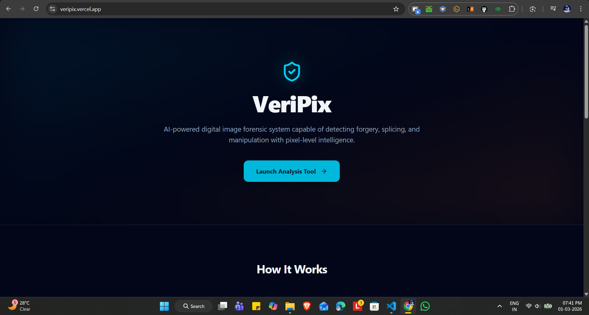
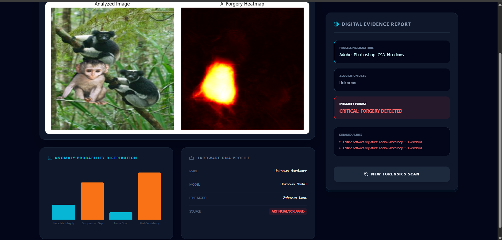
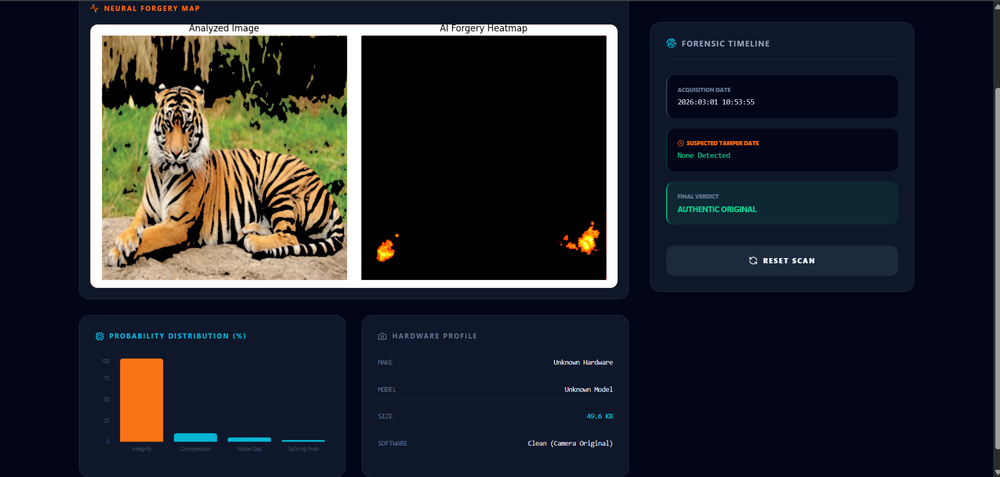
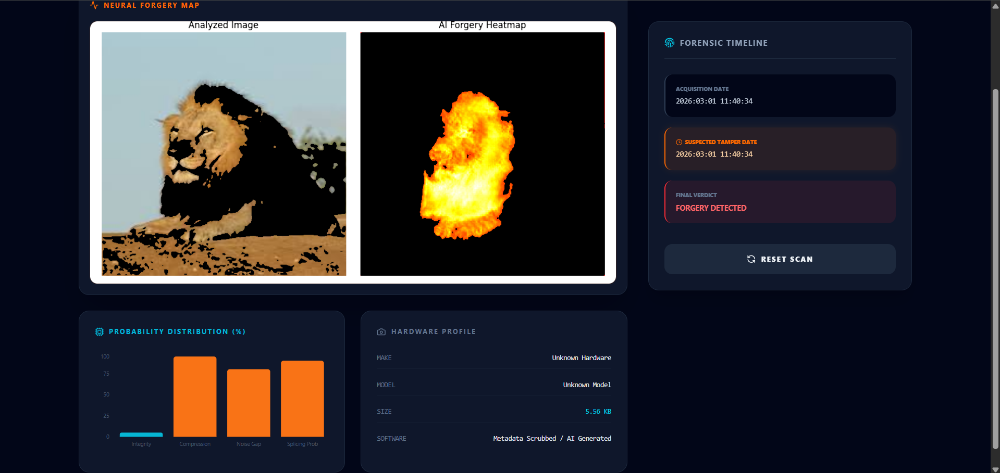

# Veripix

**Veripix** is a multi-stream deep learning system for image tampering detection and localization. It combines original image content, Error Level Analysis (ELA), and Noise Residual Maps to accurately classify and segment forged regions using CNN and U-Net-based models.

## Interface

## Analysis

---

## 🔍 Features

- Multi-stream input: Original, ELA, and Noise Residual
- Binary classification: Tampered or Authentic
- Tampered region segmentation using U-Net
- Lightweight and interpretable model architecture
- Designed for real-time and research applications

---

## 📁 Dataset

This project supports the following datasets:

- [CASIA v2.0](http://forensics.idealtest.org/)
- Columbia Image Splicing Dataset (optional)
- CoMoFoD: Copy-Move Forgery Detection Dataset (optional)

> Ensure all images are resized to 256x256 for consistency.

---

## 🧪 Preprocessing

Each image is converted into a triplet:

1. **Original Image** – Resized to 256x256  
2. **ELA Image** – JPEG saved & subtracted from original, enhanced  
3. **Noise Residual Map** – Median-filtered and subtracted  

---

## 🧠 Model Architectures

### 🔹 Veripix (Classification)

- 3 parallel CNN blocks for each input stream
- Mid-level feature fusion
- Global Average Pooling + Dense layer with sigmoid
- Output: Tampered (1) or Authentic (0)

### 🔹 Veripix-Seg (Segmentation)

- U-Net style encoder-decoder
- Input: [Original | ELA | Noise]
- Output: Binary mask for tampered regions

---

## ⚙️ Training

### Classification

- Loss: Binary Crossentropy
- Optimizer: Adam
- Metrics: Accuracy, Precision, Recall, F1, AUC

### Segmentation

- Loss: Dice + Binary Crossentropy
- Optimizer: Adam or RAdam
- Metrics: IoU, Dice Score, Pixel Accuracy

---

## 📊 Evaluation

Compare performance against:

- ELA-only CNN
- Noise-only CNN
- Original-only CNN
- Pretrained EfficientNet or ResNet baselines

---

## 📌 Results (CASIA v2.0)

| Model              | Accuracy  |
|-------------------|-----------|
| ELA + CNN         | 94.14%    |
| Noise + CNN       | 89.00%    |
| Original + CNN    | 86.00%    |
| **Veripix (Fusion)** | **96.82%** |

---

## 🧠 Explainability

- Grad-CAM or Attention maps for visual insight  
- Helps validate model decisions
---

## 📄 License

This project is for academic and research use only.

---

## 🤝 Aim

By analysing the various methods available to date, we are trying to improve the accuracy of the outcome in detection the forgery.
---

